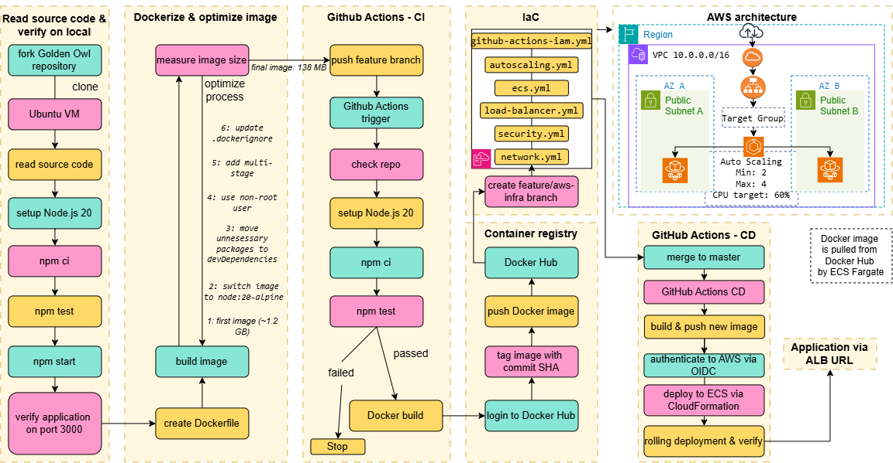

# Golden Owl DevOps Internship Challenge
## Submission Information
### Public GitHub Repository
https://github.com/ovapil/goldenowl-devops-internship-challenge
### Deployed Application
The deployment link: http://goldenowl-alb-21462567.ap-southeast-1.elb.amazonaws.com
### Visual Flow Diagram

### Docker Image Optimization
The final Docker image size is **138 MB**.
